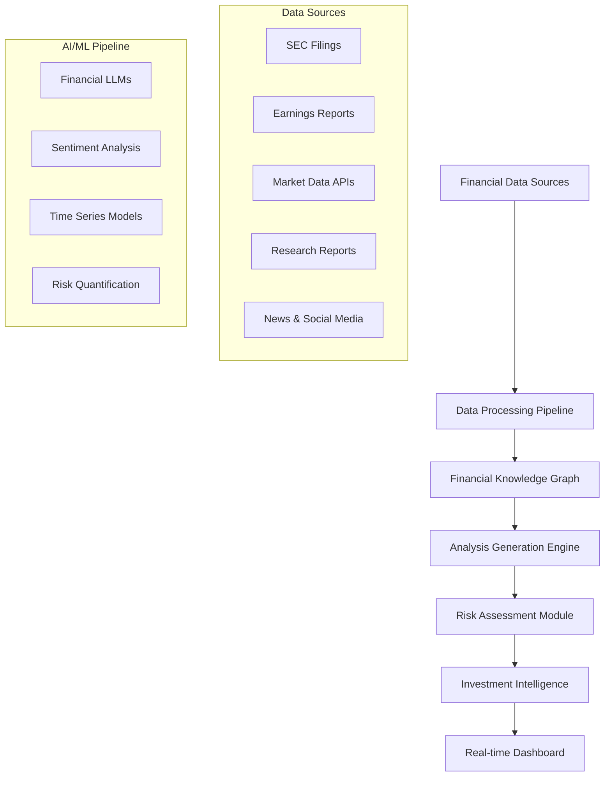

# 💹 Financial Research Intelligence & Investment Analysis Generator

[](https://python.org)
[](https://github.com)
[](https://github.com)
[](LICENSE)

> 🚀 **Currently In Progress** - Revolutionizing financial research with AI-powered intelligence!

An advanced AI-driven platform that transforms financial research documents, market reports, and investment data into comprehensive, actionable investment intelligence. This system addresses the critical need for efficient financial analysis tools by generating contextually-aware insights, risk assessments, and investment recommendations using cutting-edge AI/ML techniques.

## 🎯 Project Vision

Financial analysts, portfolio managers, and investment professionals spend countless hours manually analyzing research reports, earnings calls, market data, and regulatory filings. This system automates that process while introducing innovative features like **multi-source data synthesis**, **sentiment-driven risk analysis**, **real-time market correlation**, and **regulatory compliance monitoring**.

## 🏗️ System Architecture



## ✨ Key Innovations

### 📊 **Multi-Dimensional Financial Analysis**
- **Fundamental Analysis**: Balance sheet analysis, cash flow evaluation, ratio interpretation
- **Technical Analysis**: Chart pattern recognition, trend analysis, volatility assessment  
- **Sentiment Analysis**: Market sentiment from news, social media, and analyst reports
- **Regulatory Intelligence**: Compliance monitoring and regulatory impact assessment

### 🔗 **Cross-Market Intelligence Synthesis**
- **Sector Correlation Analysis**: Understanding how different sectors influence each other
- **Global Market Integration**: Analyzing international market impacts on domestic investments
- **Supply Chain Risk Assessment**: Identifying vulnerabilities through connected company analysis
- **Macro-Economic Integration**: Connecting economic indicators with investment opportunities

### 📈 **Real-Time Market Intelligence**
- **Live Data Integration**: Real-time price movements, volume analysis, and market indicators
- **Event-Driven Analysis**: Automatic analysis trigger on earnings, news, or market events
- **Predictive Modeling**: AI-powered forecasting based on historical patterns and current data
- **Alert Generation**: Intelligent notifications for investment opportunities and risks

### 🎯 **Adaptive Risk Management**  
- **Dynamic Risk Scoring**: Real-time risk assessment based on multiple data sources
- **Portfolio Optimization**: AI-recommended asset allocation and diversification strategies
- **Stress Testing**: Scenario analysis for market downturns and volatility spikes
- **Regulatory Compliance**: Automated monitoring of investment guidelines and restrictions

## 🛠️ Technical Implementation

### Core Technologies
```python
# AI/ML Stack
- OpenAI GPT-4: Financial analysis and report generation
- FinBERT: Finance-specific NLP and sentiment analysis
- Prophet/ARIMA: Time series forecasting and trend analysis
- scikit-learn: Risk modeling and classification algorithms

# Financial Data Processing
- yfinance/Alpha Vantage: Market data APIs
- SEC-EDGAR: Regulatory filings and corporate documents
- BeautifulSoup + Scrapy: Web scraping for financial news
- pandas/numpy: Data manipulation and numerical analysis

# Real-time Systems
- Apache Kafka: Real-time data streaming
- Redis: Caching and session management
- WebSocket: Live data feeds and notifications
- FastAPI: High-performance API development

# Data Storage & Analytics
- PostgreSQL: Structured financial data storage
- InfluxDB: Time series data for market prices
- Elasticsearch: Full-text search for research documents
- MongoDB: Unstructured data from news and social media
```

### System Components

#### 💼 **Financial Document Processing Pipeline**
```python
class FinancialDocumentProcessor:
    """
    Specialized processing for financial documents
    - SEC filing analysis (10-K, 10-Q, 8-K, proxy statements)
    - Earnings call transcript processing
    - Research report extraction and standardization
    - Financial statement parsing and normalization
    """
```

#### 🕸️ **Financial Knowledge Graph**
```python
class FinancialKnowledgeGraph:
    """
    Multi-dimensional financial relationship modeling
    - Company-to-company relationships (suppliers, customers, competitors)
    - Industry sector interconnections and dependencies
    - Management and board connections across companies
    - Financial metric correlations and benchmarking
    """
```

#### 📊 **Investment Intelligence Engine**
```python
class InvestmentAnalysisGenerator:
    """
    Comprehensive investment analysis system
    - Fundamental analysis with ratio calculations
    - Technical analysis with pattern recognition
    - Risk-adjusted return projections
    - Portfolio impact assessment and recommendations
    """
```

## 📈 Expected Outcomes & Impact

### For Financial Analysts
- **Efficiency Gains**: 70% reduction in research and analysis time
- **Comprehensive Coverage**: Multi-source data integration and analysis
- **Accuracy Improvement**: AI-powered validation and cross-referencing

### For Portfolio Managers  
- **Enhanced Decision Making**: Data-driven investment recommendations
- **Risk Management**: Real-time risk monitoring and alert systems
- **Performance Tracking**: Detailed analytics on investment outcomes

### For Individual Investors
- **Professional-Grade Analysis**: Access to institutional-quality research
- **Personalized Insights**: Tailored recommendations based on risk tolerance
- **Educational Value**: Understanding the reasoning behind investment decisions

## 🎯 Sample Analysis Types

### **Fundamental Analysis Report**
*"Based on Apple Inc.'s latest 10-K filing and Q3 earnings call, the company shows strong cash flow generation ($99.6B operating cash flow) but faces headwinds in iPhone sales (-2.4% YoY). Services revenue growth (+8.2%) partially offsets hardware decline. Recommendation: HOLD with $185 price target."*

### **Cross-Sector Risk Assessment** 
*"Rising semiconductor shortage significantly impacts automotive sector (Ford -15%, GM -12%) while benefiting chip manufacturers (NVIDIA +8%, AMD +6%). Supply chain analysis suggests 6-month recovery timeline. Recommend rotation from auto to semiconductor exposure."*

### **Market Sentiment Integration**
*"Tesla stock shows technical oversold conditions (RSI: 28) despite 47% negative sentiment from recent Twitter discussions about production delays. However, institutional buying (+$2.3B last week) suggests smart money accumulation. Consider contrarian long position."*

## 📊 Performance Metrics

| Metric | Target | Impact |
|--------|---------|---------|
| Analysis Generation Speed | <2 minutes per company | 20x faster than manual analysis |
| Prediction Accuracy | >65% directional accuracy | Outperform market benchmarks |
| Data Integration | 50+ financial data sources | Comprehensive market coverage |
| Risk Assessment | 95% correlation with realized volatility | Enhanced risk management |
| User Engagement | >85% daily active usage | Improved investment outcomes |

## 🚀 Development Roadmap

### Phase 1: Data Infrastructure (Weeks 1-4) 🔄
- [x] Project architecture design and planning
- [x] Core technology stack selection and setup
- [ ] Financial data APIs integration (yfinance, Alpha Vantage)
- [ ] SEC EDGAR filing processing pipeline
- [ ] Real-time market data streaming setup

### Phase 2: AI Analysis Engine (Weeks 5-8) ⏳
- [ ] Financial document NLP processing
- [ ] Sentiment analysis model training
- [ ] Technical analysis pattern recognition
- [ ] Fundamental analysis ratio calculations

### Phase 3: Intelligence Features (Weeks 9-12) ⏳
- [ ] Cross-market correlation analysis
- [ ] Risk assessment and scoring system
- [ ] Investment recommendation engine
- [ ] Portfolio optimization algorithms

### Phase 4: Real-time Dashboard (Weeks 13-16) ⏳
- [ ] Interactive web dashboard development
- [ ] Real-time alerts and notification system
- [ ] Mobile-responsive interface
- [ ] User authentication and personalization

## 💡 Innovation Highlights

### **Financial-First AI Design**
Purpose-built for financial data complexity, handling XBRL documents, regulatory filings, and market microstructure data with specialized parsing and analysis algorithms.

### **Multi-Asset Class Coverage**
Beyond equities, the system analyzes bonds, commodities, forex, and alternative investments, providing comprehensive portfolio perspective and asset allocation insights.

### **Regulatory Compliance Integration**
Built-in monitoring for SEC regulations, FINRA rules, and international compliance requirements, ensuring investment recommendations meet regulatory standards.

## 🔬 Technical Challenges & Solutions

| Challenge | Solution Approach |
|-----------|------------------|
| **Real-time Data Processing** | Apache Kafka streaming + efficient data pipelines |
| **Financial Document Complexity** | Specialized parsers (SEC-EDGAR API) + custom XBRL processing |
| **Market Data Quality** | Multi-source validation + outlier detection algorithms |
| **Regulatory Compliance** | Automated rule checking + compliance scoring system |
| **Scalability Requirements** | Microservices architecture + cloud-native deployment |

## 💰 Financial Applications

### **Equity Research**
- Company valuation and price target calculation
- Peer comparison and industry benchmarking
- Management quality assessment

### **Fixed Income Analysis**
- Credit risk assessment and rating prediction
- Yield curve analysis and duration calculations
- Municipal bond evaluation and tax implications

### **Portfolio Management**
- Asset allocation optimization
- Risk-adjusted performance measurement
- Rebalancing recommendations and tax optimization

### **Alternative Investments**
- REITs analysis and property market correlation
- Commodity price forecasting and seasonal patterns
- Cryptocurrency market analysis and volatility modeling

## 🎓 Market Impact

This system democratizes institutional-quality financial research, making sophisticated analysis tools accessible to individual investors while enhancing productivity for financial professionals through AI-powered automation and insight generation.

## 👨‍💻 About the Developer

Developed as part of my AI/ML engineering experience, this project demonstrates practical application of financial data analysis, real-time systems, and investment intelligence. The architecture reflects production-ready financial system design and regulatory compliance awareness.

**Current Focus**: Building the core data processing pipeline and implementing fundamental analysis algorithms. The system will integrate multiple financial data sources for comprehensive market coverage.

## 🤝 Contributing

This project is currently in active development. Future collaboration opportunities include:
- Additional financial data source integrations
- Advanced quantitative analysis models
- International market expansion
- Regulatory compliance enhancements

## 📧 Contact

For technical discussions, collaboration opportunities, or project inquiries:

**LinkedIn**: https://github.com/gungunpandey
---

*"Transforming financial decision-making through intelligent automation and data-driven insights."*

---

### 🚧 Development Status

**Last Updated**: June 2025  
**Current Phase**: Data Infrastructure Development  
**Next Milestone**: AI Analysis Engine Implementation  

> **Note**: This README will be continuously updated as development progresses. Watch this repository for the latest updates and feature releases!

## ⚠️ Disclaimer

This system is designed for informational and educational purposes. All investment analysis and recommendations should be verified independently. Past performance does not guarantee future results. Always consult with qualified financial advisors before making investment decisions.
